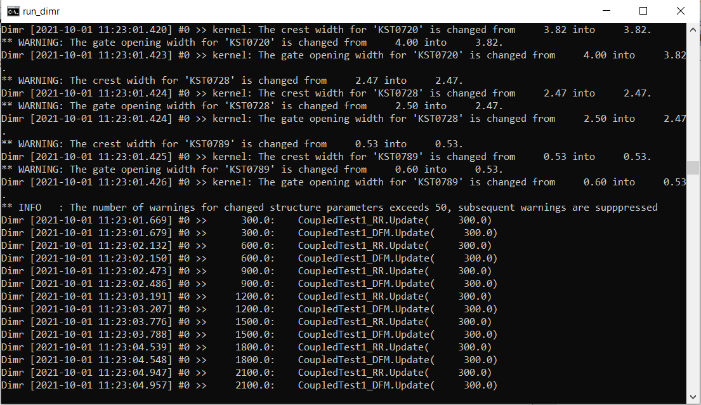
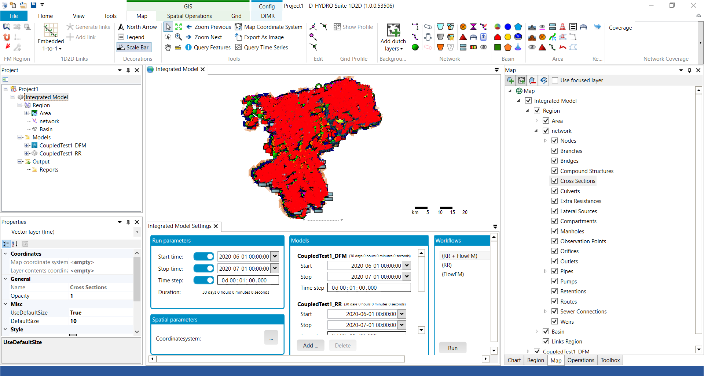

# TKI-3: Noorderzijlvest Pilot

Welkom bij de Noorderzijlvest pilot, waarin we een boezemmodel bouwen voor het beheergebied van waterschap Noorderzijlvest.

## Inhoud
In deze repository vindt u de volgende scripts:

### Jupyter Notebooks
- notebooks\modelbouw.ipynb: het modelbouw notebook waarmee het boezemmodel is gebouwd
- notebooks\modeltests.ipynb: een notebook waarmee u de laatst optredende waterstand in een simulatie kunt vergelijken met streefpeil
- notebooks\lateralen_hma.ipynb: hiermee kunt u lateralbestanden genereren voor het FM model met een constante afvoer uitgedrukt in mm/dag
- notebooks\herschrijven_rr_boundaries.ipynb: voor het herschrijven van een RR model op een reeds gebouwd FM model
- notebooks\genereer_buien.ipynb: voor het genereren van bui-bestanden
- scripts\numlimdt.py: script voor het wegschrijven van de tijdstapreductie in een shapefile
- scripts\groepcodes_duikers.py: script voor het aanmaken van groepcodes per duiker bij aanliggende duikers

## Bouwen D-HYDRO model
Voor het bouwen van het D-HYDRO model volgt u de volgende stappen:

### Aanmaken delft3dfm python omgeving
Het aanmaken van een delft3dfmpy omgeving staat beschreven op de D-HYDAMO repository:
1. Zorg voor een D-HyDAMO-omgeving: https://github.com/openearth/delft3dfmpy#installation
2. Activeer de delft3dfmpy omgeving via de Anaconda-prompt (niet te verwarren met de reguliere Windows Command Prompt!):
```
conda activate delft3dfmpy
```

### Bouwen D-HYDRO model
Voor ht draaien van 
1. Download de broncode van dit script (Button [Code]) en plaats hem op de harde schijf.
2. Open Jupyter Notebook via command-prompt in de geactiveerde omgeving:
```
jupyter notebook
```
3. Selecteer modelbouw.ipynb vanuit Jupyter Notebook
4. Volg nauwkeurig de stappen in het modelbouw notebook.

## Draaien D-HYDRO model in DIMR
Voor het draaien van en D-HYDRO model schrijft D-HYDAMO een run.bat bestand. Dit bestand staat op de locatie van dimr_config.xml 
en bevat een verwijzing naar de run_dimr.bat batchfile, onderdeel van uw D-HYDRO installatie:
```
@ echo off
set OMP_NUM_THREADS=2
call "c:\Program Files\Deltares\D-HYDRO Suite 1D2D (1.0.0.53506)\plugins\DeltaShell.Dimr\kernels\x64\dimr\scripts\run_dimr.bat"
pause
```

U vindt een run.bat en dimr_config.xml bestand in de basismap van uw model, maar ook in de fm-map. Met de eerste draait u een gecombineerd 
FM/RR model, met de laatste alleen het FM-model:



## Importeren D-HYDRO model in Suite
Het importeren van het model in de GUI van de D-HYDRO Suite doet u door na het openen van D-HYDRO de `Import DIMR configuration` uit te voeren. 
U verwijst hierbij naar de dimr_config.xml in de hoofdfolder voor het importeren van het FM/RR model of naar de dimr_config.xml in de FM-folder voor het 
importeren van alleen het FM model.

